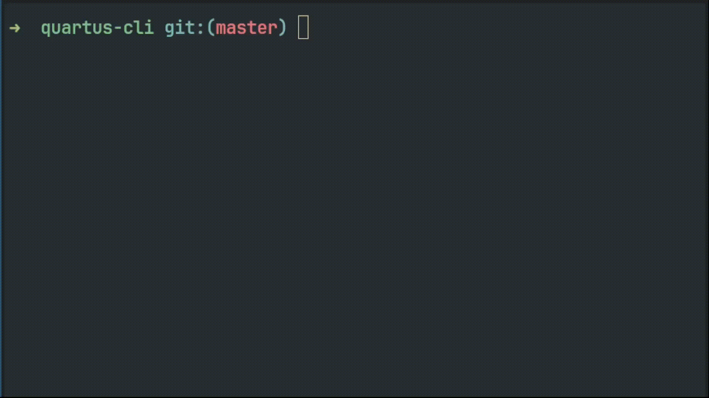

# quartus-cli

A tool for building and flashing Intel FPGA designs from the command line. It is meant to be cross-compatible with Quartus Prime Lite 25.1, so you can either open the project files made by this tool in the Quartus GUI or edit the VHDL source files in your text-editor of choice!



## Prerequisites

- Quartus Prime Lite 25.1 installed
- Board-specific packages installed for your target FPGA

## Setup

Pull the repo and make `quartus-cli` executable. It might be convenient to add it to your path or have it as an alias.

```bash
git clone https://github.com/Luca-Jones/quartus-cli
cd quartus-cli
chmod +x quartus-cli
export PATH=$PATH:$(pwd) # temporarily add to the path
```

## Usage

All commands should be run from the **top-level directory** of your project. The project name and default top-level entity name are inherited from this directory name.


1. Create a project directory
2. Write your source files and declare at least the top-level entity
3. Adjust project configuration options in a file called `quartus.conf` if needed
4. `quartus-cli build` to compile
5. `quartus-cli flash` to program your board

## Project Structure

The script searches for all nested `.vhd` files within the project directory, so you may organize your source files however you like. Below is a simple example with a single `.vhd` file

```
example_project/
├── quartus.conf            # optional
├── main.vhd
│                           # below are auto-generated
├── db                      
├── incremental_db          
├── example_project.qpf
├── example_project.qsf
└── output_files
```

## VHDL Entities

An entity is the interface declaration of a VHDL module that defines the inputs and outputs. The architecture that follows it contains the actual logic implementation. The **top-level entity** is the one Quartus uses as the entry point. If your top-level entity name differs from the project directory name, specify it in `quartus.conf`.

```vhdl
entity example_entity is
    port(
        SW   : in  std_logic_vector(9 downto 0);
        LEDR : out std_logic_vector(9 downto 0)
    );
end entity;

architecture behavior of example_entity is
begin
    LEDR <= SW;
end architecture;
```

## Configuration

Optionally create a `quartus.conf` file in your project directory to override defaults.

| Option | Default | Description |
|--------|---------|-------------|
| `BOARD` | `"MAX 10 DE10 - Lite"` | Target development board. Determines the FPGA family, device, and pin assignments. |
| `OUT_DIR` | `"output_files"` | Directory for build outputs (.pof, .sof, reports, etc.). |
| `TOP_LEVEL_ENTITY` | Project directory name | The entry-point entity for your design. Must match an entity defined in one of your VHDL files. |
| `PERSISTENT_PROGRAMMING` | `false` | When `true`, flashes a .pof file so the board retains the program after power loss. When `false`, flashes a .sof file that is lost on power cycle. |

## Supported Boards
-  "MAX 10 DE10 - Lite"
